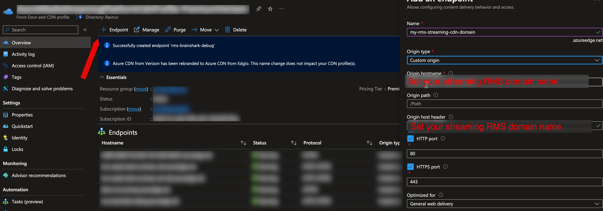

# Complete guide of Migration to RMS

## Prerequisites

✅ You have an RMS instance deployed using Azure Marketplace.

✅ You have a Microsoft account with access to an Azure Tenant where the RMS instance is deployed.

> [!Note]
> Consider the following scenarios before starting:
> 1. **Encrypted Videos (AES or DRM)**: If you have a large number of encrypted videos (AES or DRM) consider using the migration option to generate new keys instead of migrating existing ones. AMS API throttling will not allow you to migrate more than 1200 assets per hour if they have content keys. Contact us to turn on the key-generation option in the migration configuration for you.
> 
> 2. **Content Key Policies**: Check if you have a large number of content key policies in your AMS account (e.g., policy per asset). This is considered bad practice from AMS's perspective (see [Best Practices and Considerations](https://learn.microsoft.com/en-us/azure/media-services/latest/drm-content-key-policy-concept#best-practices-and-considerations)) and is limited by AMS throttling to 1200 requests per hour. There is an option to apply a single policy for all migrated streaming locators of the same encryption scheme. Contact us, and we will specify it in the migration configuration before you start.
>

## Get RMS Connection Credentials

How to get RMS connection credentials you can find [here](how-to-get-credentials.md)

## Register Your AMS Storage(s) in RMS

How to register custom storage account with RMS you can find [here](custom-storage.md)

## Migrate Your Application

The RMS API mirrors the AMS API, meaning no significant code changes are required. You can continue using your existing SDK and logic without modifications. However, RMS uses a different authentication scheme, so you will need to update your code to use the new credentials. You can copy them from the following sources:

* For **Azure.ResourceManager.Media SDK**, use [this implementation](../sdk-azure-resource-manager-demo/RmsApiKeyCredentials.cs).
* For **Microsoft.Azure.Management.Media SDK**, use [this implementation](../sdk-ms-azure-management-demo/RmsApiKeyCredentials.cs).

Then your media service client initialization code will look like this:

```CSharp
// For Microsoft.Azure.Management.Media SDK
var credentials = new RmsApiKeyCredentials(
    new Uri("<RMS API endpoint>"),
    "<RMS Subscription ID>",
    "<RMS API Key>");

var mediaServicesClient = new AzureMediaServicesClient(credentials, new HttpClient(), true)
{
    SubscriptionId = "<RMS Subscription ID>"
};
// All mediaServicesClient method calls then use RMS Resource Group and Account Name
```

or

```CSharp
// For Azure.ResourceManager.Media SDK
var credentials = new RmsApiKeyCredentials(
    new Uri("<RMS API endpoint>"),
    "<RMS Subscription ID>",
    "<RMS API Key>");

ArmClient armClient = new ArmClient(
        credentials,
        "<RMS Subscription ID>",
        new ArmClientOptions
        {
            Environment = new ArmEnvironment(new Uri("<RMS API endpoint>"), "test"),
        });

var mediaServicesAccountIdentifier = MediaServicesAccountResource.CreateResourceIdentifier(
    "<RMS Subscription ID>",
    "<RMS Resource Group Name>",
    "<RMS Account Name>");

var mediaServiceClient = armClient.GetMediaServicesAccountResource(mediaServicesAccountIdentifier)
```

After applying these updates, your media service client initialization will be adapted for RMS.

You can see detailed implementations for a demo application that can switch between AMS and RMS:

* For **Azure.ResourceManager.Media SDK**, see [sdk-azure-resource-manager-demo](../sdk-azure-resource-manager-demo).
* For **Microsoft.Azure.Management.Media SDK**, see [sdk-ms-azure-management-demo](../sdk-ms-azure-management-demo).

## Replace Azure Media Player with Another Player

Azure Media Player was developed specifically for AMS streams and does not work with other streaming links, including those from RMS. You need to use a different player. Currently, the following players are compatible with RMS:

* [Ravnur Media Player](https://strmsdemo.z13.web.core.windows.net/)
* hls.js
* dash.js

You can find developer guide how to setup Ravnur Media Player [here](ravnur-player-instructions.md).

## Validation

At this stage, you have completed the RMS compatibility changes in steps 2 and 3. Ensure the following:
- your transforms work properly in RMS producing the expected output
- videos are streamed according to your streaming and content key policies

This validates the success of the Migration steps above.

Additionally, the Streaming URL has been updated: the host name has been changed from the AMS endpoint to the RMS endpoint.

Old URL: http://ams111-aaaa.streaming.media.azure.net/...

New URL: http://fd-111a1aaaaa1-a1aaaaaaaaaaaaa.z02.azurefd.net/...

This URL change proves the successful completion of backend compatibility. A change of the player, surely, would represent the completion of front-end changes.

Please proceed with the remaining steps to fully complete the procedure.


## Change Event Grid Subscriptions

RMS produces the same Event Grid events schema as AMS. Use [these instructions](monitoring.md) to change your current Event Grid subscriptions to listen to RMS events instead.

> [!NOTE]
> For this, your RMS instance should be deployed in the same subscription as your current AMS account.

## AMS metadata migration

At this point you have your storages registered in RMS and you ensured that your application works seamlessly with RMS API. Now you can migrate all your existing AMS assets metadata to RMS. This migration copies only metadata of your assets; it does not copy or move your assets contents from storage. [These instructions](data-migration.md) will guide you through this process.

## Streaming Endpoints

There is no migration of streaming endpoints from AMS to RMS. RMS does not support full streaming endpoints functionality. It contains only one hard-coded streaming endpoint which you can't remove. By default RMS streaming endpoint uses same domain name as API and Console. The only RMS streaming endpoint property which you can change is HostName which your code may require for producing streaming URLs (it concatenates Streaming Endpoint host name with Streaming Locator paths). If you are using CDN then you must specify your CDN domain name there (to verify it navigate to your Streaming Endpoint in Azure Portal). CDN migration instructions will tell you what actions are required from you in this case. If you do not want to use CDN but still want to use your custom domain name then please contact us and we will setup your custom domain in RMS for you.

## Update CDN configuration

### Change CDN domain

The AMS streaming domain will be deleted immediately after the AMS account is deleted. If you keep the AMS account active, it will be available for a while after AMS shutdown, but Microsoft will delete the DNS records before the end of 2024. So we highly recommend that you prepare your own custom domain for your CDN in advance before migrating to RMS.
It means that all your existing streaming links should be updated from the AMS streaming endpoint domain to your own custom domain instead.
There are two way to use new domain:

1. Create separate CDN enpoint which is pointed to RMS streaming enpoint. It is a prefferable option.
2. Reuse your existing CDN endpoint (which you use for AMS account) and map your custom domain to that endpoint.
   [Here](https://learn.microsoft.com/en-us/azure/cdn/cdn-map-content-to-custom-domain) Microsoft gives instructions how to do this. After that your CDN endpoint should look like this:
   
  > [!Note]
> Second option makes releasing updates more difficult therefore is not recommended. There could be downtime after switching from AMS to RMS and purging the CDN cache. It's recommended to set up and test a separate CDN endpoint first, and then switch all video links to it.

### Option 1: Create separate CDN enpoint which uses RMS as origin (recommended)

1. Create and enpoint specifying RMS streaming domain as origin (it matches the RMS API endpoint domain)
   
2. Wait for the origin change to propagate in the CDN. This can take a while. To ensure that the new origin is available, you can check the URL in a browser: "https://{your custom CDN domain}/console".
3. Then. To complete migration you just need to:
   * Repoint your application to use RMS API instead of AMS
   * Update existing streaming links in your system to use new streaming domain.

### Option 2: Change origin for existing CDN enpoint

If for some reason you want to reuse existing CDN endpoint (you have some complicated and specific settings) you can use this option. As far as you change existing enpoint after this step, all your existing streaming links will be routed to the RMS streaming server. That's why it should be performed as part of your final migration procedure and incorporated into your first release with RMS, which can look like this:

1. Repoint your application to use RMS API instead of AMS
   After this step your application will create all new videos in RMS instead of AMS, but their links will not work from CDN until the next step is completed.
2. Change your CDN origin
   * Navigate to your AMS Streaming Endpoint CDN profile
   * Select the endpoint routed to your AMS endpoint. 
   * Change the origin to your RMS streaming domain (it matches the RMS API endpoint domain). 
   * Wait for the origin change to propagate in the CDN. This can take a while. To ensure that the new origin is available, you can check the URL in a browser: "https://{your custom CDN domain}/console".
3. Purge your CDN cache.
   Your CDN contains cached AMS manifests with AMS segments URLs. And if some of segments are not in cache it will go to RMS which does not recognize such URLs. That's why please purge your CDN cache to ensure that all your VODs are correctly streamed.
   
   As a result, all video URLs will now be streamed from RMS. No need to update existing streaming links similar to [Option 1](https://github.com/Ravnur-Inc/ams-api-replacement-demo-app/blob/main/docs/app-migration.md#option-1-create-separate-cdn-enpoint-which-uses-rms-as-origin-recommended) - it's done automatically.

### Specify the CDN domain as a new RMS streaming endpoint hostname

You need to do this in both cases: Option 1 and Option 2.
1. Go to RMS Console -> Manage -> Streaming Endpoints.
   
2. Remember the host name of your RMS streaming endpoint, as you will need to use it as the new origin for your CDN
3. In the "Host Name" text box, specify your CDN domain name (for AMS, it's the AMS streaming endpoint hostname), and then click "Save"
   
   
  > [!Note]
> Without completing this step, your application may generate streaming links with the RMS origin domain instead of your CDN domain. It is because RMS API returns it to your application as a streaming endpoint hostname.
