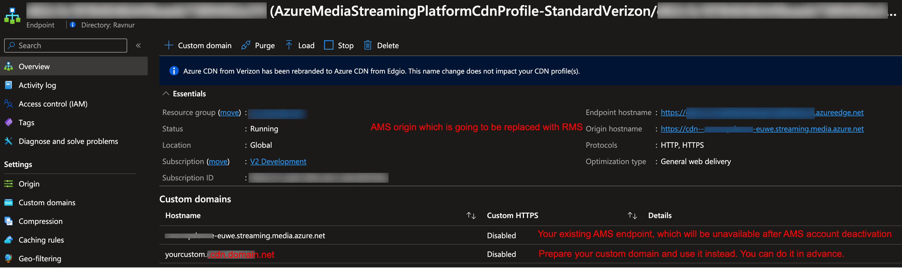

# Complete guide of Migration to RMS

## Prerequisites

✅ You have an RMS instance deployed using Azure Marketplace.

✅ You have a Microsoft account with access to an Azure Tenant where the RMS instance is deployed.

## Get RMS Connection Credentials

How to get RMS connection credentials you can find [here](how-to-get-credentials.md)

## Register Your AMS Storage(s) in RMS

How to register custom storage account with RMS you can find [here](custom-storage.md)

## Migrate Your Application

The RMS API mirrors the AMS API, meaning no significant code changes are required. You can continue using your existing SDK and logic without modifications. However, RMS uses a different authentication scheme, so you will need to update your code to use the new credentials. You can copy them from the following sources:

* For **Azure.ResourceManager.Media SDK**, use [this implementation](../sdk-azure-resource-manager-demo/RmsApiKeyCredentials.cs).
* For **Microsoft.Azure.Management.Media SDK**, use [this implementation](../sdk-ms-azure-management-demo/RmsApiKeyCredentials.cs).

Then your media service client initialization code will look like this:

```CSharp
// For Microsoft.Azure.Management.Media SDK
var credentials = new RmsApiKeyCredentials(
    new Uri("<RMS API endpoint>"),
    "<RMS Subscription ID>",
    "<RMS API Key>");

var mediaServicesClient = new AzureMediaServicesClient(credentials, new HttpClient(), true)
{
    SubscriptionId = "<RMS Subscription ID>"
};
// All mediaServicesClient method calls then use RMS Resource Group and Account Name
```

or

```CSharp
// For Azure.ResourceManager.Media SDK
var credentials = new RmsApiKeyCredentials(
    new Uri("<RMS API endpoint>"),
    "<RMS Subscription ID>",
    "<RMS API Key>");

ArmClient armClient = new ArmClient(
        credentials,
        "<RMS Subscription ID>",
        new ArmClientOptions
        {
            Environment = new ArmEnvironment(new Uri("<RMS API endpoint>"), "test"),
        });

var mediaServicesAccountIdentifier = MediaServicesAccountResource.CreateResourceIdentifier(
    "<RMS Subscription ID>",
    "<RMS Resource Group Name>",
    "<RMS Account Name>");

var mediaServiceClient = armClient.GetMediaServicesAccountResource(mediaServicesAccountIdentifier)
```

After applying these updates, your media service client initialization will be adapted for RMS.

You can see detailed implementations for a demo application that can switch between AMS and RMS:

* For **Azure.ResourceManager.Media SDK**, see [sdk-azure-resource-manager-demo](../sdk-azure-resource-manager-demo).
* For **Microsoft.Azure.Management.Media SDK**, see [sdk-ms-azure-management-demo](../sdk-ms-azure-management-demo).

## Replace Azure Media Player with Another Player

Azure Media Player was developed specifically for AMS streams and does not work with other streaming links, including those from RMS. You need to use a different player. Currently, the following players are compatible with RMS:

* [Ravnur Media Player](https://strmsdemo.z13.web.core.windows.net/)
* hls.js
* dash.js

You can find developer guide how to setup Ravnur Media Player [here](ravnur-player-instructions.md).

## Change Event Grid Subscriptions

RMS produces the same Event Grid events schema as AMS. Use [these instructions](monitoring.md) to change your current Event Grid subscriptions to listen to RMS events instead.

> [!NOTE] For this, your RMS instance should be deployed in the same subscription as your current AMS account.

## AMS metadata migration

At this point you have your storages registered in RMS and you ensured that your application works seamlessly with RMS API. Now you can migrate all your existing AMS assets metadata to RMS. This migration copies only metadata of your assets; it does not copy or move your assets contents from storage. [These instructions](data-migration.md) will guide you throug this process.

## Update CDN configuration

### Change CDN domain

AMS streaming domain will be unavailable after AMS account deactivation. So please prepare your own custom domain for your CDN in advance, [here](https://learn.microsoft.com/en-us/azure/cdn/cdn-map-content-to-custom-domain) Microsoft gives instructions how to do this. After that your CDN endpoint should look like this:

Also it means that all your existing streaming links should not use AMS streaming endpoint and use your own custom domain instead.

### Change CDN Origin

After this step, all your existing streaming links will be routed to RMS streaming server. That's why it should be performed as part of your final migration procedure and incorporated into your first release with RMS, which can look like this:

1. Specify CDN domain as a new RMS streaming endpoint hostname
   * Go to RMS Console -> Manage -> Streaming Endpoints.
     
   * Remember the host name of your RMS streaming endpoint, as you will need to use it as the new origin for your CDN
   * In the "Host Name" text box, specify your CDN domain name (for AMS, it's the AMS streaming endpoint hostname), and then click "Save"
     
   > [!NOTE] Without completing this step, your application may generate streaming links with the RMS origin domain instead of your CDN domain. It is because RMS API returns it to your application as a streaming endpoint hostname.
2. Repoint your application to use RMS API
   After this step your application will create all new videos in RMS instead of AMS, but their links will not work from CDN until the next step is completed.
3. Change your CDN origin
   * Navigate to your AMS Streaming Endpoint CDN profile
   * Select the endpoint routed to your AMS endpoint. 
   * Change the origin to your RMS streaming domain (it matches the RMS API endpoint domain). 
   * Wait for the origin change to propagate in the CDN. This can take a while. To ensure that the new origin is available, you can check the URL in a browser: "https://{your custom CDN domain}/console".
4. Purge your CDN cache.
   Your CDN contains cached AMS manifests with AMS segments URLs. And if some of segments are not in cache it will go to RMS which does not recognize such URLs. That's why please purge your CDN cache to ensure that all your VODs are correctly streamed.
