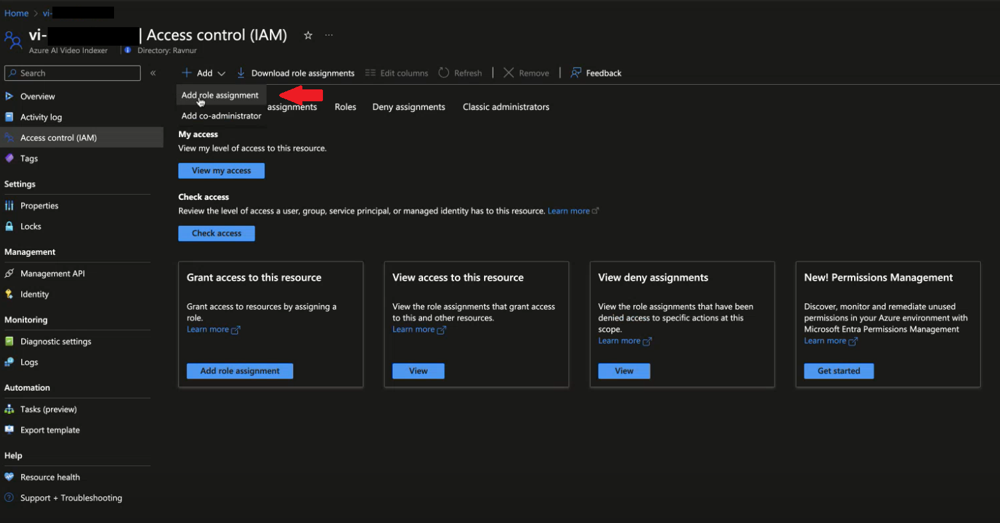
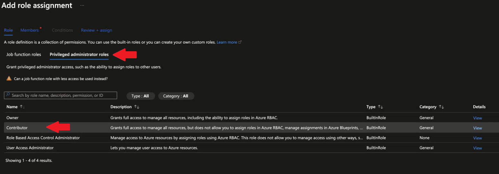
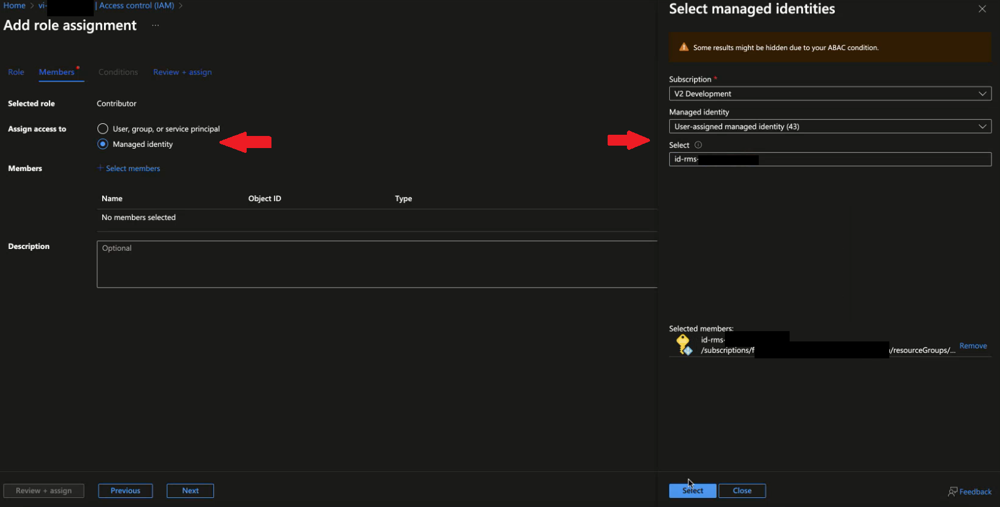
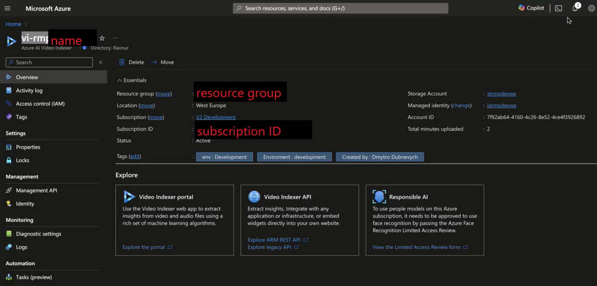

# CC generation using Video Indexer in RMS (beta)

Generate subtitles from the audio record of your videos now with the "Video indexer" service available. It can be configured in the RMS Console with the help of this guide.

> [!NOTE]
> Currently this functionality is in beta version. Contact us if you face any issues with it.

## Prerequisites

✅  Create a video indexer account (azure)

> [!NOTE]
> Placing a Video Indexer account in the RMS Managed Resource group leads to access issues. The Video Indexer account, Video Indexer storage, and the Managed Identity it employs for authorization should be located outside the RMS Managed Resource group.

## Grant Video Indexer "Contributor" role to RMS managed identity

1. Go to the managed resource group and [locate the “Managed Identity”](https://github.com/Ravnur-Inc/ams-api-replacement-demo-app/blob/main/docs/find-managed.md) section with the Managed Identity name. Copy it for later.

2. Select your Azure AI Video Indexer

3. Navigate to **Access Control (IAM)**

4. Press on **Add** > **Add role assignment**
    

5. Switch the tab to **Privileged administrator roles** and select the **Contributor** role
    

6. Press the **Managed identity** and **Select members**

7. In the new window, set the Managed identity as "User-assigned managed identity" and set the Select field to be your Managed Identity from step 1.

    

8. Finally, press **Select**, change the tab to **Review+assign** and press **Review+assign** in the left corner.

As a result, this Managed Identity has access to the Video Indexer.

## Register Video Indexer in RMS

1. Use the Azure Portal credentials to set up the Video Indexer.

   * Account name.

   * Resource group

   * Subscription ID

    

2.  Request Ravnur support via support@ravnur.com to add a Video Indexer account by providing all the data from step 1.

This is it. Now you can run jobs for AudioAnalyzer preset.
