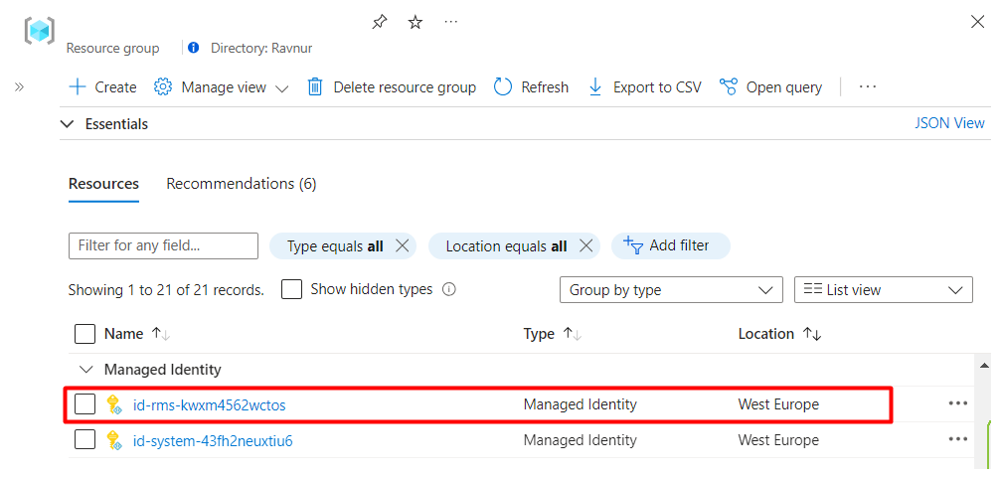
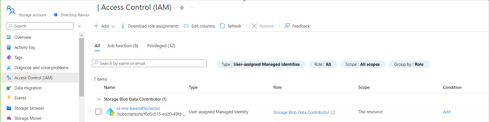
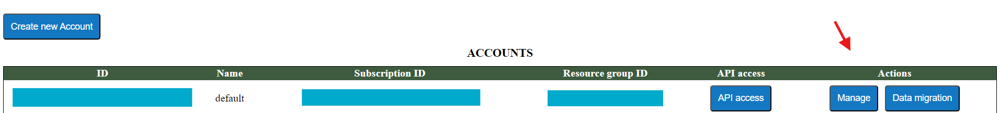
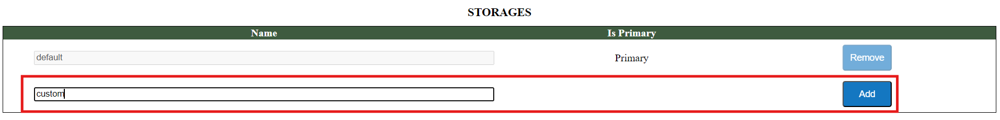
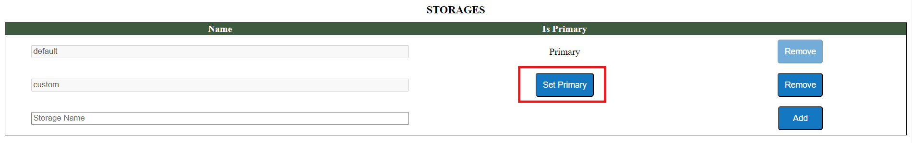

## How to configure Ravnur Media Services to work with your existing storage account 

Ravnur Media Services allows you to continue using your existing storage accounts. Your current AMS account may have one or more storage accounts connected to it, and you can continue to use them. You will need to setup user-assigned managed identity access to your storage account to enable a secure connection between RMS and your storage account.

The following section provides a step-by-step guide on how to connect your existing storage account(s) to Ravnur Media Services.

### Locate the User-Assigned Managed Identity

1. Go to the managed resource group created by the Ravnur Media Services deployment
2. Under the list of resources, go to the “Managed Identity” section
3. Copy its name to use in steps further

> The name of the Managed Identity will be unique for your specific deployment, however, it always follows a pattern "id-rms-\<unique-suffix\>"

### Grant storage permissions to the Managed Identity

1. Go to the storage account you want to connect with Ravnur Media Services
2. Navigate to Access Control (IAM) section
3. Assign the following role to the Managed Identity (Step 3 [above](#locate-the-user-assigned-managed-identity)) from the Ravnur Media Services managed resource group:
- Storage Blob Data Contributor

The step-by-step guide on how to assign Azure roles using the Azure portal can be found in [Azure RBAC documentation](https://learn.microsoft.com/en-us/azure/role-based-access-control/role-assignments-portal)

### Add storage configuration to the Ravnur Media Services

1. Navigate to the Ravnur Media Services management console. Use the [following instructions](https://github.com/Ravnur-Inc/ams-api-replacement-demo-app/blob/main/docs/how-to-get-credentials.md).

2. Click the "Manage" button for the corresponding account

3. Add a new storage account record

The "Name" field should contain the name of the storage account you are connecting.

4. Set the new storage account as Primary

> **Important!**
> It may take up to 10 minutes to propagate the change of the primary storage account throughout the system
