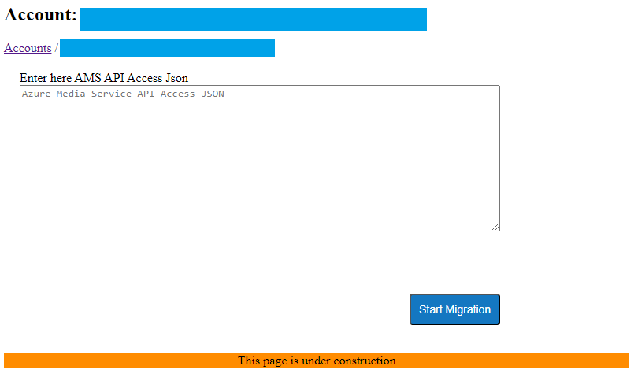

# AMS Account Data Migration to RMS

To enable the continued playback of media stored in your AMS storage account with RMS, follow the migration procedure outlined below. This process involves copying the  necessary entities from your AMS account to the RMS database.

Entities to be migrated:
- Transforms: these are configurations for common tasks, like encoding or analyzing videos. Each Transform outlines a workflow for processing media files.
- Content Key Policies: used to configure how a content key is delivered to media clients.
- Streaming Policies: defines streaming protocols and encryption options for streaming locators
- Assets: each Asset is a container holding all media-related files, such as videos, captions, and manifests. They serve various purposes, from storing video-on-demand content to live streaming outputs.
- Streaming Locators: builds streaming URLs for client players to stream media from Assets. They can be associated with filters, streaming policies, and content key policies.

> [!Note]
> Asset Filters: Filters are not migrated by default, but there is a way around it. Please contact Ravnur if this option should be included for you.

Assets contents are not going to be copied or moved from the storage only its metadata will be migrated.
This process is only a part of a bigger procedure of migration to RMS. That's why we recommend to [read it](app-migration.md) before starting migration.

## Pre requisites

1. You need to know your RMS host name and be able to login to the RMS console. You can find how to do that using [these instructions](how-to-get-credentials.md).
2. Your AMS storage accounts need to be registered in your RMS instance.  Use [these instructions](custom-storage.md) to do that.
3. The AMS storage account you need to migrate data from, must be selected as "Primary" in [RMS Console](custom-storage.md). This is a mandatory step.

## Get AMS credentials

1. Open the Azure Portal and navigate to the AMS account that needs to be migrated.

2. Navigate to API Access.
      

3. Scroll down to the "Connect to Media Services API" section and select JSON view.
      

4. Retrieve the AZURE_CLIENT_ID and AZURE_CLIENT_SECRET values using this [instruction](https://learn.microsoft.com/en-us/azure/databricks/dev-tools/service-prin-aad-token#--provision-a-service-principal-in-azure-portal). Ensure the Token expiration is not less than one week because the migration process can take days, depending on the media count. Also, confirm that your AMS account has a Microsoft Entra Id (AAD) application assigned with the "Contributor" role.
      
   
## Start Migration

1. Open RMS Console and click the "Data migration" button for your RMS account.
      
You will see a form where you should enter AMS API Access JSON credentials in JSON format. Then press "Start Migration" button.
      

2. You will see the migration status form with source AMS account inforamtion and a list of migration steps. Depending on media count, the migration process can take from a couple of hours to several days.
      

3. Upon successful completion, the Migration Info table will display a "Completed" status, and the Steps table will show counts of migrated items.
      
   If an error occurred during the migration process, the status will be "Failed", with details in the Steps table.

4. If new items were added to your AMS account after migration, and you want to add them to RMS, open the Data Migration page and press the "Sync latest changes" button.

## Migration Errors
If the migration process finishes with an error, please contact Ravnur for assistance in resolving the issues and completing the migration process.
