# How to configure and test DRM feature
RMS supports Google Widevine, Microsof PlayReady and Apple FairPlay DRM technologies, each of them can be used on appropriate devices and operation systems. You can find full Platform Compatibility table here: https://www.drm.cloud/platform-compatibility.
RMS use EZDRM as license provider, so before start using DRM on RMS you need to create account on EZDRM https://www.ezdrm.com. When account is created you should store your EZDRM credentials in SQL DB table Settings as Key="ezdrm.username" Value="[username]", Key="ezdrm.password" Value="[password]". Note that this values are cached for 30 min.

## Widevine DRM
Widevine DRM technology can be used on webkit browsers (Chrome, Opera, Firefox) on Windows and macOS.
First of all, you need to configure your EZDRM Widevine account. Enter https://[rms_domain]/drmservice/widevine as Authorization URL.
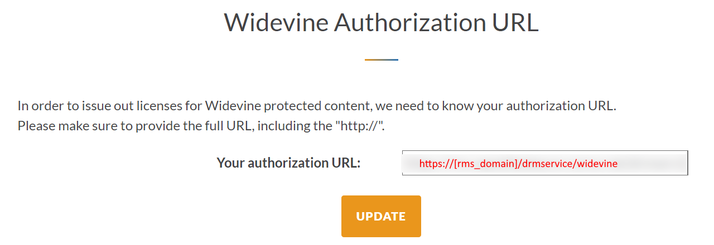

1. Create Content Key Policy with Widevine option. Set appropriate Issuer, Audience and KeyValue(Base64-encoded string). Additional claims cam be added in Required Claims array if needed.
```JSON
{
    "properties": {
        "description": "multi-drm-cenc",
        "options": [
            {
                "name": "widevine-option",
                "configuration": {
                    "@odata.type": "#Microsoft.Media.ContentKeyPolicyWidevineConfiguration",
                    "widevineTemplate": "{\n    \"allowed_track_types\": \"SD_HD\",\n    \"content_key_specs\": [\n        {\n            \"track_type\": \"SD\",\n            \"security_level\": 1,\n            \"required_output_protection\": {\n                \"HDCP\": \"HDCP_NONE\"\n            }\n        }\n    ],\n    \"policy_overrides\": {\n        \"can_play\": true,\n        \"can_persist\": true,\n        \"can_renew\": false,\n        \"rental_duration_seconds\": 2592000,\n        \"playback_duration_seconds\": 10800,\n        \"license_duration_seconds\": 604800\n    }\n}"
                },
                "restriction": {
                    "restrictionTokenType": "Jwt",
                    "@odata.type": "#Microsoft.Media.ContentKeyPolicyTokenRestriction",
                    "issuer": "ravnur",
                    "audience": "test",
                    "primaryVerificationKey": {
                        "@odata.type": "#Microsoft.Media.ContentKeyPolicySymmetricTokenKey",
                        "keyValue": "8RyJAV6mc6kk7m7ywFeyO6oUp0Jam1UoqvxEs/UhjrRElWdoD15R6iBWi1Am+En1s6Lv3pbYN94+Nt+3BdxETw=="
                    },
                    "alternateVerificationKeys": [],
                    "requiredClaims": []
                }
            }
        ]
    }
}
```
WidevineTemplate field contains streaming restrictions in Json format, details about it can be found here https://learn.microsoft.com/en-us/azure/media-services/latest/drm-widevine-license-template-concept

2. Create Streaming Locator for existing asset with appropriate Content Key Policy and Streaming Policy. Streaming Policy can be Predefined_MultiDrmStreaming or Predefined_MultiDrmCencStreaming.
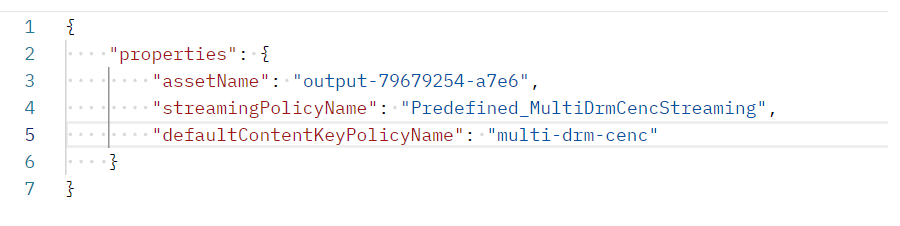

3. Then you need to get streaming paths.
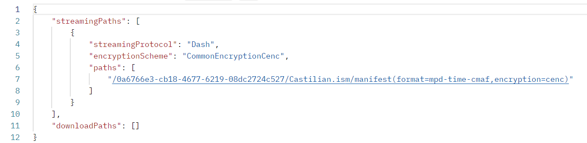

4. For playback testing we can use SHAKA Player. Open browser that supports Widevine, go To https://shaka-player-demo.appspot.com/demo -> Custom Content and create new player source. Enter streaming url to Manifest URL field.

    

5. Select DRM pane. In Custom License Server URL field you need to enter https://widevine-dash.ezdrm.com/widevine-php/widevine-foreignkey.php?pX=[ezdrm_widevine_profile_id]&locatorid=[locator_id]&authorization=[token]
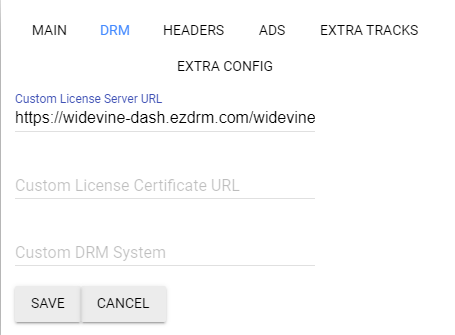

ezdrm_widevine_profile_id - get from Widevine DRM profile in your EZDRM Account:
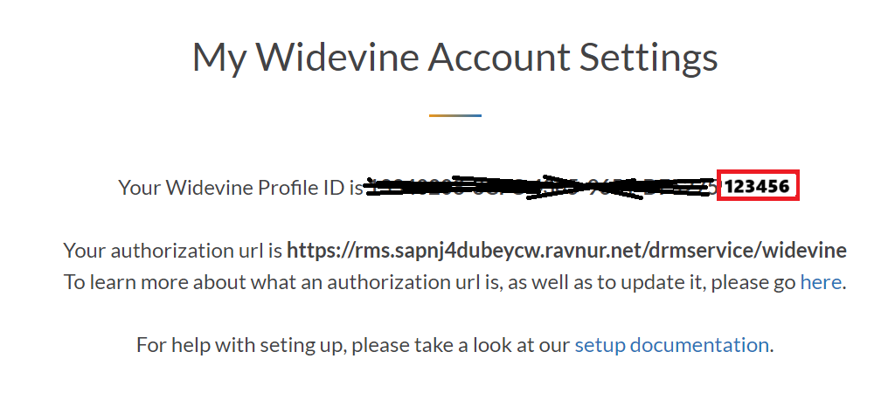

locator_id - ID of Streaming Locator you have created on step 2.

token - JWT token to authorize your access to media. How to generate appropriate token will be explained below.

6. Now media can be played.

## PlayReady DRM
PlayReady DRM technology can be used on Edge browsers on Windows. More details about it you can read here https://learn.microsoft.com/en-us/playready/overview/overview.
First of all, you need to configure your EZDRM Widevine account. Enter https://[rms_domain]/drmservice/playready as Authorization URL.
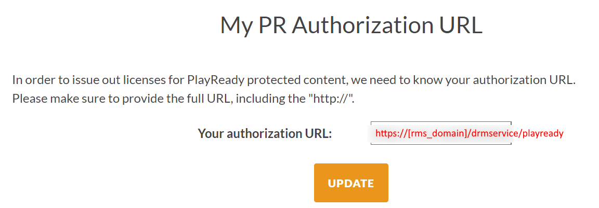

1. Create Content Key Policy with PlayReady option. Set appropriate Issuer, Audience and KeyValue(Base64-encoded string). Additional claims cam be added in RequiredClaims array if needed.
```JSON
{
    "properties": {
        "description": "multi-drm-cenc",
        "options": [
            {
                "name": "playready-option",
                "configuration": {
                    "@odata.type": "#Microsoft.Media.ContentKeyPolicyPlayReadyConfiguration",
                    "licenses": [
                        {
                            "securityLevel": "SL2000",
                            "licenseType": "Persistent",
                            "contentType": "Unspecified",
                            "allowTestDevices": false,
                            "playRight": {
                                "allowPassingVideoContentToUnknownOutput": "Allowed",
                                "firstPlayExpiration": "P1D",
                                "digitalVideoOnlyContentRestriction": false,
                                "imageConstraintForAnalogComponentVideoRestriction": false,
                                "imageConstraintForAnalogComputerMonitorRestriction": false
                            },
                            "contentKeyLocation": {
                                "@odata.type": "#Microsoft.Media.ContentKeyPolicyPlayReadyContentEncryptionKeyFromHeader"
                            }
                        }
                    ]
                },
                "restriction": {
                    "restrictionTokenType": "Jwt",
                    "@odata.type": "#Microsoft.Media.ContentKeyPolicyTokenRestriction",
                    "issuer": "ravnur",
                    "audience": "test",
                    "primaryVerificationKey": {
                        "@odata.type": "#Microsoft.Media.ContentKeyPolicySymmetricTokenKey",
                        "keyValue": "AopgfzcxUkS9LaQJtUxhlw=="
                    },
                    "alternateVerificationKeys": [],
                    "requiredClaims": []
                }
            }
        ]
    }
}
```
Licenses field contains streaming restriction setting, details about it can be found here: https://learn.microsoft.com/en-us/playready/overview/license-and-policies

2. Create Streaming Locator for existing asset with appropriate Content Key Policy and Streaming Policy. Streaming Policy can be Predefined_MultiDrmStreaming or Predefined_MultiDrmCencStreaming.


3. Then you need to get streaming paths.


4. For playback testing we can use SHAKA Player. Open browser that supports PlayReady (Edge), go To https://shaka-player-demo.appspot.com/demo -> Custom Content and create new player source. Enter streaming url to Manifest URL field.

    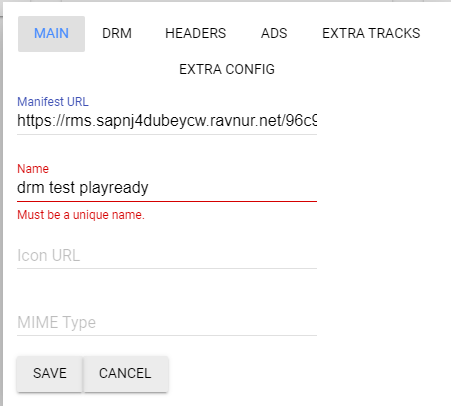

5. Go to DRM pane. In Custom License Server URL field you need to enter https://playready.ezdrm.com/cency/preauth.aspx?pX=[ezdrm_playready_profile_id]&locatorid=[locator_id]&authorization=[token]
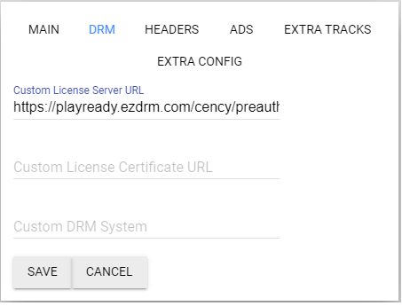

ezdrm_playready_profile_id - get from Widevine DRM profile in your EZDRM Account:
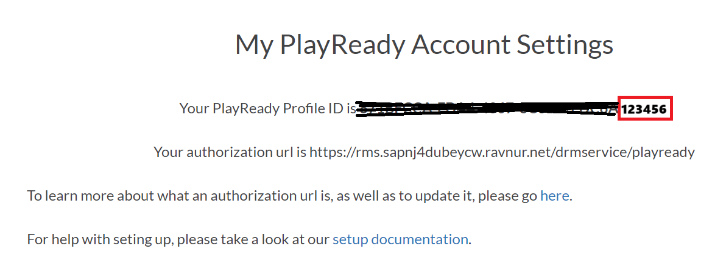

locator_id - ID of Streaming Locator you have created on step 2

token - JWT token to authorize your access to media. How to generate appropriate token will be explained below.

6. Now media can be played.

## FairPlay DRM
Apple FairPlay technology can be used on Apple devices - iOS/ipadOS and with Safari on macOS. First of all, you need to get AFP Certificate from Apple and configure your EZDRM FairPlay account. Instruction on how to do that you can find in your EZDRM account.
Then you need to create AssetID, to do this you need to send Get request http://cpix.ezdrm.com/kalturagetasset.aspx?u=[username]&p=[password] (replace [username] and [password] with your EZDRM credentials). After that you will se AssetID in you EZDRM account.
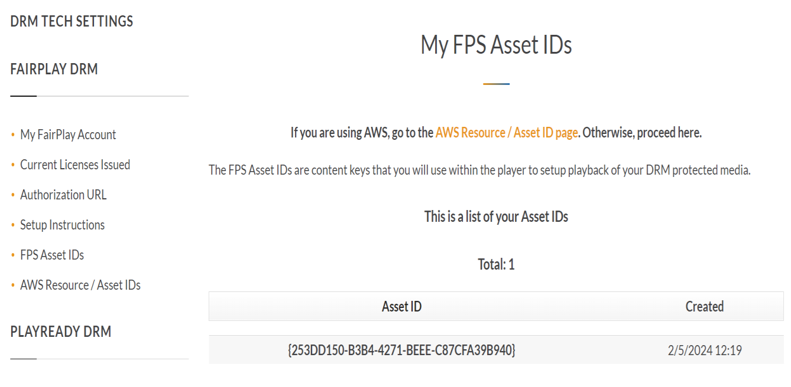
The AssetID should be sores in you SQL DB table Settings as Key="ezdrm.fpsassetid" Value="[AssetID]". Note that this value is cached for 30 min.
To play FairPlay DRM source player also requires URL to AFP Certificate, so it should be stored somewhere with public or protected access (e.g. Azure storage blob with SAS or public access).
Then you need to set https://[rms_domain]/drmservice/playready as Autorization URL.
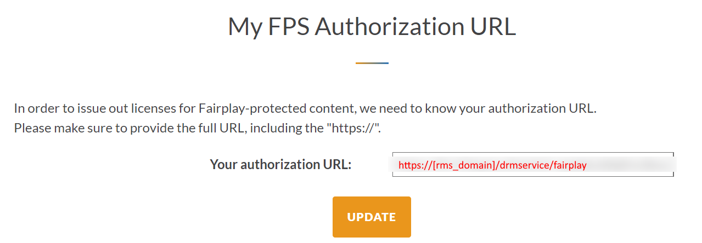

1. Create Content Key Policy with FairPlay option. Set appropriate Issuer, Audience and KeyValue(Base64-encoded string). Additional claims cam be added in RequiredClaims array if needed.
```JSON
{
    "properties": {
        "description": "drm-cbcs",
        "options": [
            {
                "policyOptionId": "63e86438-adbe-4af4-37d5-08dc2690c330",
                "name": "fairplay-option",
                "configuration": {
                    "rentalAndLeaseKeyType": "DualExpiry",
                    "@odata.type": "#Microsoft.Media.ContentKeyPolicyFairPlayConfiguration"
                },
                "restriction": {
                    "restrictionTokenType": "Jwt",
                    "@odata.type": "#Microsoft.Media.ContentKeyPolicyTokenRestriction",
                    "issuer": "ravnur",
                    "audience": "test",
                    "primaryVerificationKey": {
                        "@odata.type": "#Microsoft.Media.ContentKeyPolicySymmetricTokenKey",
                        "keyValue": "AopgfzcxUkS9LaQJtUxhlw=="
                    },
                    "alternateVerificationKeys": [],
                    "requiredClaims": []
                }
            }
        ]
    }
}
```

2. Create Streaming Locator for existing asset with appropriate Content Key Policy and Streaming Policy. Streaming Policy should be Predefined_MultiDrmStreaming.
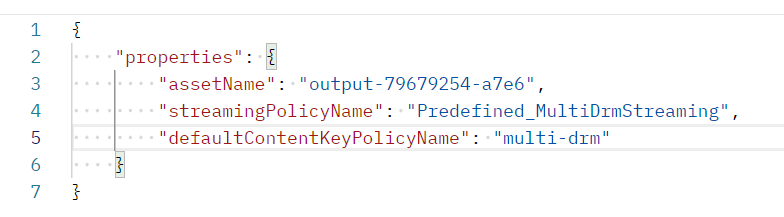

3. Then you need to get streaming paths.
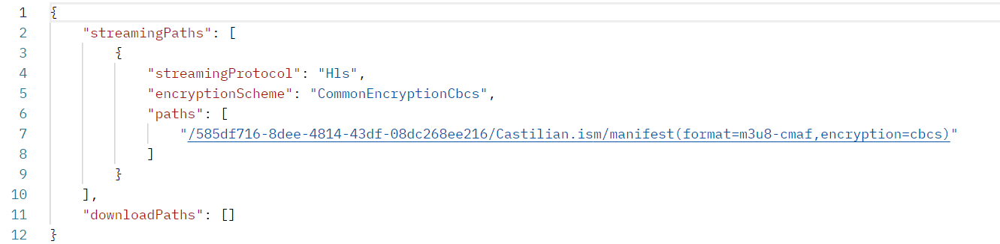

4.  For playback testing we can use SHAKA Player. Open browser that supports FairPlay, go To https://shaka-player-demo.appspot.com/demo -> Custom Content and create new player source. Enter streaming url to Manifest URL field.
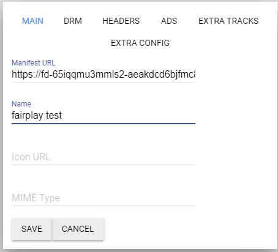

5. Go to DRM pane. In Custom License Server URL field you need to enter https://fps.ezdrm.com/api/licenses/[fairplay_asset_id]?locatorid=[locator_id]&authorization=[token], in Custom License Certificate URL enter the URL to your Apple FairPlay sertificate.

   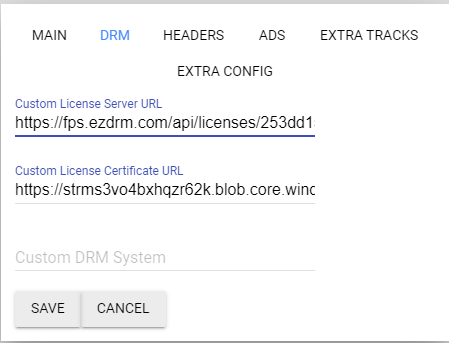

fairplay_asset_id - AssetID from your EZDRM FairPlay Account.

locator_id - ID of Streaming Locator you have created on step 2

token - JWT token to authorize your access to media. How to generate appropriate token will be explained below.

6. Now media can be played.

## How to generate Authorization Token
For testing purposes Authorization Token can be generated on https://jwt.io/

1. Put this JSON as payload data:
```JSON
{
    "exp": 1707265900,
    "nbf": 1707244300,
    "iss": "ravnur",
    "aud": "test"
}
```
exp - token expiration date in unix timestamp format (You can edit it right there in payload field and tip will show you readable value).

nbf - token validity start date in unix timestamp format.

iss - issuer value from Content Key Policy.

aud - audience value from Content Key Policy.

If you have any additional Required CLaims in your Content Key Policy, you should add it to payload data.

2. Enter Primary Verification Key, you can get it from Content Key Policy that was used to create Streaming Locator that you want to play.
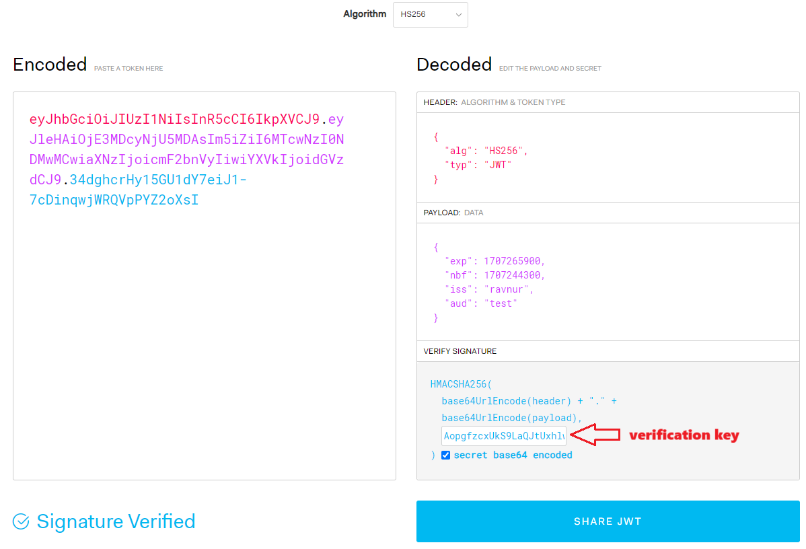

3. Now you can get your token from input field on the left.

RMS supports two additional token claims:
1. "urn:microsoft:azure:mediaservices:maxuses" : "[uses_count]" - this claim allows you to restrict token usage count. When using this feature, requests with tokens whose expiry time is more than one hour away from the time the request is received are rejected with an unauthorized response.
2. "urn:microsoft:azure:mediaservices:contentkeyidentifier" : "[streaming_locator_id]" - restrict token to be used only with specified streaming locator. If you want to use this claim you also need to add it to appropriate Content Key Policy with empty value.

## NOTES

1. You can create single Content Key Policy with all required DRM options, in this case Streaming Locator created with this Content Key Policy will be playable on any device. But there is restriction related to Streaming Policies: Predefined_MultiDrmStreaming can work with all three DRM technologies, Predefined_MultiDrmCencStreaming can work only with Widevine and PlayReady. This mean that you can create one Content Key Policy with all three DRM tech, but depending on Streaming Policy you've selected when creating Streaming Locator, this locator will work on Apple devices or not.
2. 
