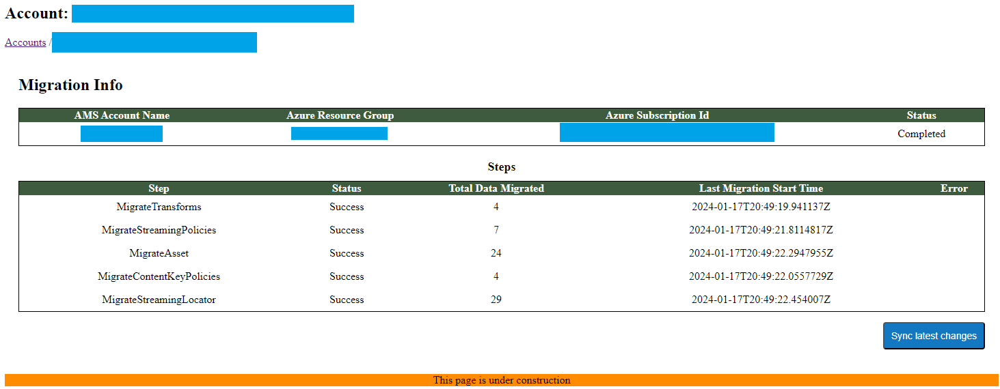

# Post-migration checklist

On this page, you can find the migration checklist explaining what has been prepared by following the [Complete Migration Guide to RMS](/docs/app-migration.md). You will also get some insights on the recommended go-live approaches.

### **Migration checklist**

The Azure Media Services (AMS) storage accounts are registered in the RMS system by following this step:

1.  [Register Your AMS Storage Account(s) in RMS](/docs/custom-storage.md) ✅
    

All RMS compatibility code changes are done:

2.  [Connect your application to RMS](/docs/app-migration.md#migrate-your-application) ✅
    
3.  [Replace Azure Media Player with Another Player](/docs/app-migration.md#replace-azure-media-player-with-another-player) ✅  
    

The AMS metadata is migrated to the RMS system by following this step:

4.  [AMS Account Data Migration to RMS](/docs/data-migration.md) ✅
    

The Content Delivery Network (CDN) is configured for the RMS endpoint once you are done with:

5.  [Update CDN configuration](/docs/app-migration.md#update-cdn-configuration) ✅
    
---

### User-Side Compatibility Configuration:

Before going live, it is worth carefully assessing media service configurations to ensure compatibility with RMS. This entails considering all features and structures unique to their application.

Here are some examples of adjustments not covered by the RMS migration process:

*   **Proxy setup for AES encrypted streaming on IOS/OSX devices.**
    

For additional context, you may refer to the instructions:

[Token-authorized AES-encrypted HLS streams work in Safari](https://azure.microsoft.com/fr-fr/blog/how-to-make-token-authorized-aes-encrypted-hls-stream-working-in-safari/) (Azure blog)

[Token-authorized AES encrypted HLS stream working in Safari](https://github.com/AzureMediaServicesSamples/HLSSafariProxy) (Azure GitHub Samples)

[HLS Proxy service for AES encrypted HLS stream](https://github.com/sdesyllas/hls-proxy-aes-service)

*   **DRM configurations to protect your media content across different platforms and devices.** Navigate to “[How to configure and test the DRM feature](/docs/drm-user-guide.md)” to learn more.
    
*   **Encrypted AMS V2 assets decryption**
    
It's essential to thoroughly review their entire application setup to identify any such custom configurations requiring adjustment to align with RMS compatibility.

---

### **Post-Migration release procedure**

At this point, you've confirmed that your application operates properly with RMS and successfully migrated your AMS account data to RMS. Now, it's time to switch your production application to an RMS account. While the procedure may vary depending on your system, the following are recommended instructions:

*   **Deploy New Application Version:**  
    Deploy a new version of your application that is configured to use RMS instead of AMS.
    
*   **Replace Streaming URL host name:**  
    Replacing AMS streaming endpoint host name with RMS endpoint host name.
    

> [!NOTE]
> This is a different process from configuring the Content Delivery Network (CDN), which ensures that requests are routed to the correct origin (RMS). The current task involves updating all internal references to the media content within your application to point to the new domain correctly.

*   **Modify the application to use RMS credentials**
    

Ensure that the application can perform its tasks with RMS after the previous [User-Side Compatibility Configuration](t#User-Side-Compatibility-Configuration) is completed.

*   Optional - **Sync latest AMS changes:**
    

> [!NOTE]
> If no videos/data were updated since the AMS metadata migration (the service was on freeze), there is no need for this step.

1.  Access the migration panel in the [RMS Console](/docs/how-to-get-credentials.md) and press the “Data migration" button.
    
2.  Press the "Sync Latest Changes" button to migrate recent changes made since the previous migration run.
    

 It triggers the migration process to synchronize any new items from the source Azure Media Services (AMS) account since the previous migration run. This ensures that any additions made to the source AMS account after the last migration are captured and migrated to the destination RMS account.

---
All done! You have prepared your media service application to take advantage of RMS. By migrating all necessary data and updating core settings, you've made a successful transition. Your application is now fully operational with RMS, ready for production use.
