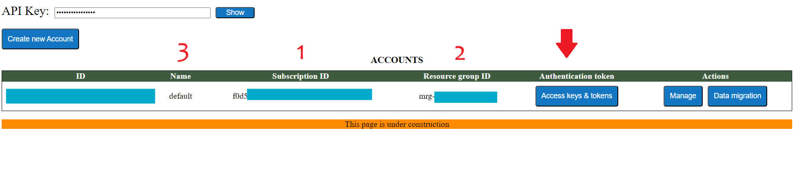
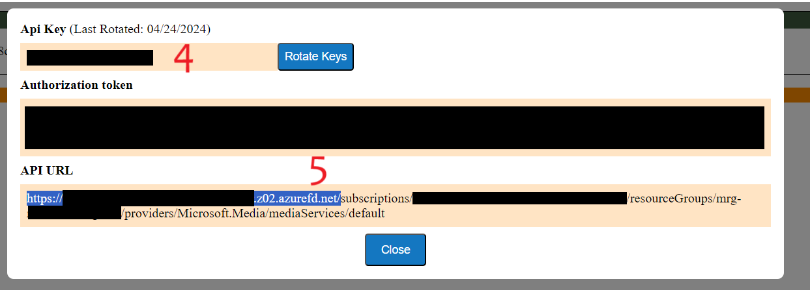

# How to get RMS connection credentials

1. On the Azure Portal, go to RMS Managed Application resource: Managed Applications center -> Marketplace Applications -> Find RMS Application and open it.
2. Then click on "Parameters and Outputs". 
3. In the list of outputs, copy "consoleURL" and open it in a browser. 
4. On the Console page, copy all necessary RMS connection credentials and save them to be later specified in your app configuration.
   
   * 1 - RMS Subscription ID;
   * 2 - RMS Resource Group Name;
   * 3 - RMS Account Name;
   * 4 - RMS API Key;
   * 5 - RMS API Endpoint (`https://{unique-string}.azurefd.net/`).

