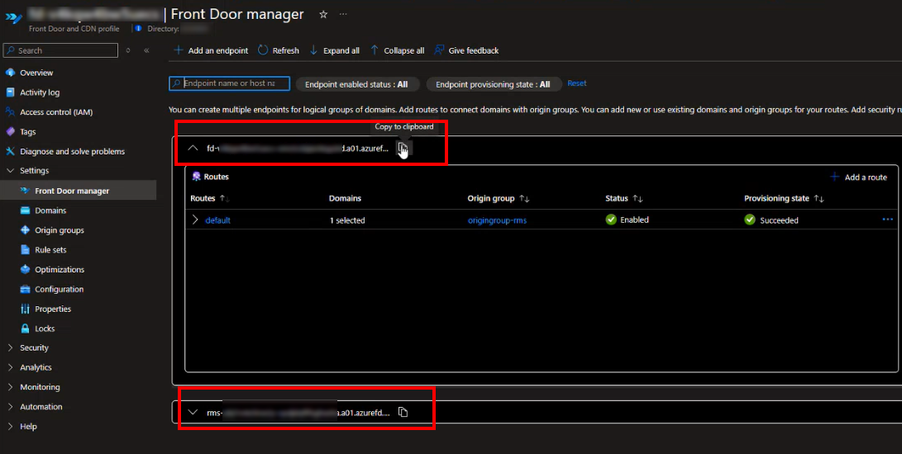

# How to get RMS connection credentials

1. Locate your RMS domain:

* In Azure Portal, navigate to: Resource group > Front Door and CDN > Front Door manager:  

* Copy the domain that follows this format: `fd-{unique-value}.azurefd.net` or `rms-{unique-value}.azurefd.net`

  
  > Depending on your setup, there might be several domains, as shown in the screenshot above. Any of them can be used to access the RMS Console, as they all point to the same service.
2. Access your console simply by adding `/console` to your RMS URL:
   `https://{your-domain}.ravnur.net/console/`
3. Select the API Credentials tab in the RMS Console:
    
4. Copy all necessary RMS connection credentials in a JSON format and save them to be specified in your app configuration.
   

* RMS Subscription ID;
* RMS Resource Group Name;
* RMS Account Name;
* RMS API Key
* RMS API Endpoint.
