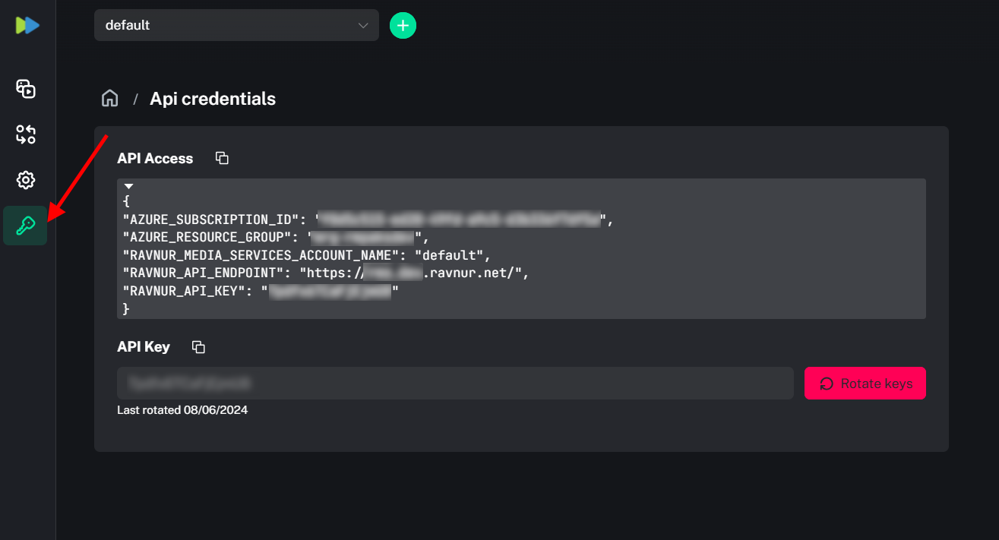

# How to get RMS connection credentials

1. Access your console simply by adding `/console` to your RMS URL:
   `https://{your-domain}.ravnur.net/console/`
2. Select the API Credentials tab in the RMS Console:
    
3. Copy all necessary RMS connection credentials in a JSON format and save them to be specified in your app configuration.
   

* RMS Subscription ID;
* RMS Resource Group Name;
* RMS Account Name;
* RMS API Key
* RMS API Endpoint.
