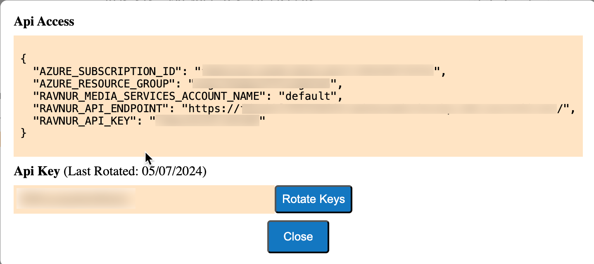

# How to get RMS connection credentials

1. On the Azure Portal, go to RMS Managed Application resource: Managed Applications center -> Marketplace Applications -> Find RMS Application and open it.
2. Then click on "Parameters and Outputs". 
3. In the list of outputs, copy "consoleURL" and open it in a browser. 
4. On the Console page, press the "API Access" button next to your account.
5. Copy all necessary RMS connection credentials in a JSON format and save them to be specified in your app configuration.
   
    
* RMS Subscription ID;
* RMS Resource Group Name;
* RMS Account Name;
* RMS API Key
* RMS API Endpoint.

> [!NOTE]
> The format is generated for the [AMS Explorer](https://github.com/Ravnur-Inc/Azure-Media-Services-Explorer) setting while credentials for other apps e. g. SDK mirror those values although the field names vary. 
