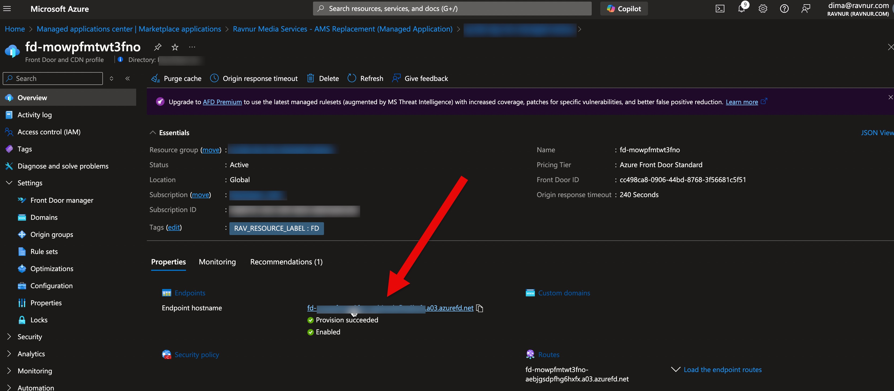
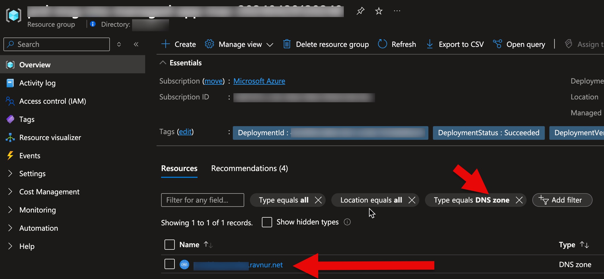
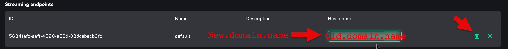
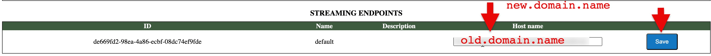

# RMS Streaming Domain

## Default Streaming Domains

By default, RMS has two domain names that can be used in streaming links: the RMS front door domain and the RMS origin streaming endpoint domain. The front door endpoint acts as a CDN, and RMS uses it by default (Streaming Endpoint Host Name). It is not recommended to use the RMS origin domain directly for streaming, but you can map your custom CDN to it.

### How to Get the RMS Front Door Domain?

The RMS front door domain name looks like this: "fd-{unique string}.{AFD DNS subdomain}.azurefd.net".
You can find it in your RMS resource group. Its name is "fd-{unique string}" and it is the only front door in your resource group.
It contains only one default endpoint:

### How to Obtain the RMS Origin Domain?

The RMS origin domain looks like this: "i-rms.{unique string}.ravnur.net".
You can find the exact name by locating your RMS DNS zone in your RMS resource group. There is only one DNS zone resource in your RMS resource group.

## How to Use a Custom Domain with the RMS Front Door?

* Create a CNAME record for the alias host domain so that it points to the RMS native front door endpoint: "fd-{unique string}.{AFD DNS subdomain}.azurefd.net". How to Get the RMS Front Door Domain you can find [here](#how-to-get-the-rms-front-door-domain). Documentation on how to create and map a CNAME is here: [Add a custom domain to Azure Front Door](https://learn.microsoft.com/en-us/azure/frontdoor/front-door-custom-domain#create-a-cname-dns-record).
* Make an RMS support request (by email) to add your custom domain name to the RMS front door. Provide RMS support with your domain name and RMS resource group.

## How to Update the RMS Streaming Domain Name?

If you decide to use your custom CDN or custom domain name in the RMS front door, you need to perform this action.

### Prerequisites:

You have a domain name that is already mapped to the RMS streaming origin "i-rms.{unique string}.ravnur.net" (CDN domain name or custom domain name in the RMS front door).

### Steps:

1. Go to the RMS Console.
2. Choose your account -> Manage -> Streaming Endpoints.
3. Change the **Host Name** property field and press the **Save** button:
   
   For the old console:
   

4. Change the streaming domain name on your side:
   - **Update static streaming links** with the new domain name. If your application dynamically composes streaming links and does not store static ones, this step is not required.
   - **Update your configuration.** If your application requests the streaming domain from the RMS API and does not store the domain in its configuration, this step is not required.

