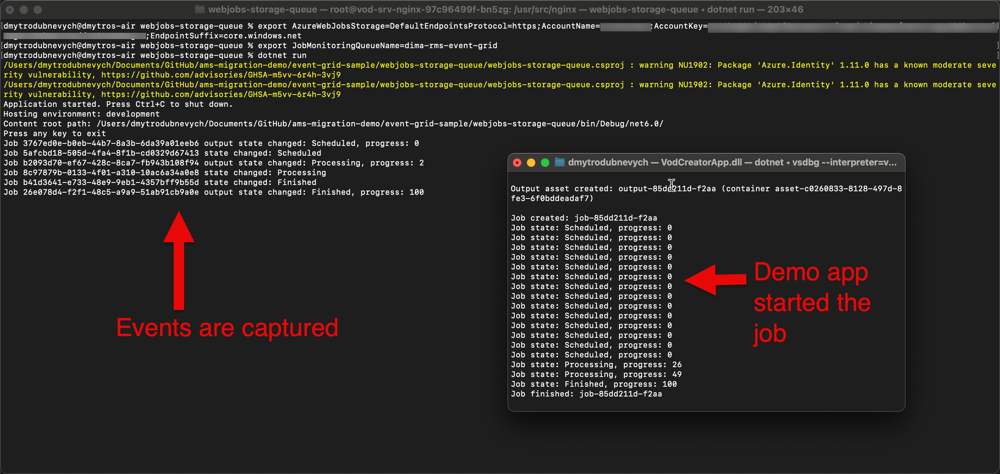

# Azure web job for listening RMS events from storage queue

## Pre-requisites

You need to create subscription to RMS/AMS event grid topic. Instrucitons how to do it for RMS you can find [here](../../docs/monitoring.md).
This sample works with Storage Queue. That's why Service Bus subscription will not work.
WARNING! It will consume all messages from specified queue. So use it only for your non-Prod environment as a POC.

## Set environment variables

It requires 2 variables to be setup:

* "AzureWebJobsStorage" - it should contain your storage connection string
* "JobMonitoringQueueName" - it should contain your storage queue name

## Start application

```console
dotnet run
```

If you want to monitor concrete job you need to specify arguments

```console
dotnet run <transform name> <job name>
```

## Monitor



## Stop

To stop application press any key. Be aware that it will consume all messages from your queue.

## Useful links

[How to create Event Grid subscriptions](https://learn.microsoft.com/en-us/azure/data-explorer/ingest-data-event-grid-manual)
[Azure WebJobs SDK turtorial](https://learn.microsoft.com/en-us/azure/app-service/webjobs-sdk-get-started)
