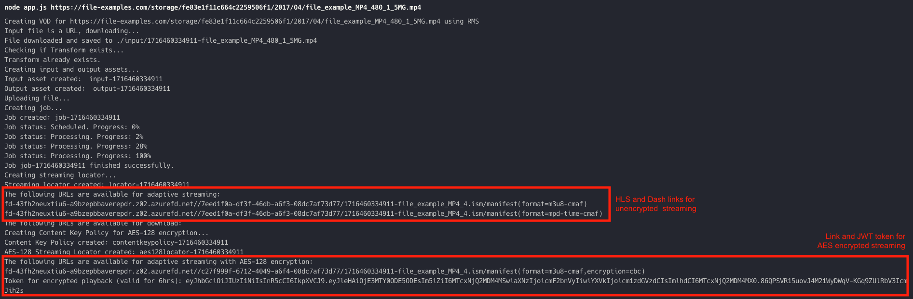

### Configure and run the RMS API Demo Application for the Node.js

1. Open a command prompt in your working directory
2. Clone the repo: ```git clone https://github.com/Ravnur-Inc/ams-api-replacement-demo-app.git```
3. Go to app folder ```cd ams-api-replacement-demo-app/node-js-demo```
4. Get your RMS instance credentials using [these instructions](../docs/how-to-get-credentials.md)
5. To configure the RMS connection, create `.env` file in app root folder and set the following environment variables (if you use the Ravnur-hosted RMS POC instance, contact us to get those credentials):

    ```code
    SUBSCRIPTION_ID=<RMS account subscription ID>
    RESOURCE_GROUP_NAME=<RMS account resource group name>
    MEDIA_SERVICES_ACCOUNT_NAME=<RMS account name>
    API_ENDPOINT=<RMS instance API endpoint>
    API_KEY=<RMS instance API key>
    ```
6. Install dependencies:

    ```console
    npm install
    ```

    If you start the application without any command line arguments, it will encode the default video that is included in the package using the configured RMS instance. However, you probably will want to upload and encode your own videos, so you can specify the video file to encode as a command line argument:

    ```console
    node app.js <local path or URL of a video/audio file>
    ```


    If for some reason you need test videos, this link has several: https://gist.github.com/jsturgis/3b19447b304616f18657<br>
    The app creates simple custom transform which generates: 3 video qualities, 1 audio quality and several thumbnail images.<br>
    Then it applies to your video and make two streaming locators: 1 - unencrypted HLS/DASH streaming locator with downloads enabled, 2 - AES-128 encrypted HLS streaming locator.

7. The output of the program will look like this:
    
    > [!NOTE]
    > A job can stay in Queued state for a minute. The Ravnur-hosted RMS instance is shared, so potentially it can take even longer if all VMs in the pool are occupied. The encoding pool size is configurable, so if you need to support 20 concurrent encoding jobs, for example, you can set the pool size to meet your needs.
8. Grab a streaming URL and test the playback in a player:
    https://hlsjs.video-dev.org/demo/ - for HLS
    https://reference.dashif.org/dash.js/latest/samples/dash-if-reference-player/index.html - for DASH<br>
    https://strmsdemo.z13.web.core.windows.net/ - Ravnur Media Player (HLS) with option for AES-128 encryption

    > [!NOTE]
    > The RMS streaming URLs will not work with the Azure Media Player. It, too, is being retired, and we can't say we're sad to see it go. You will need to replace the AMP with a new player, and ideally you should test the streaming locator with your player of choice.<br>

9. Inspect the code to ensure that it shares the same SDK instructions (except for the connection/credentials part). This code is in [VodProvider.js](VodProvider.js) file. For example here you can find transform code which you can change to try your own settings. Transform configurations (`TRANSFORM_DATA`) you can find in [transform-data.js](transform-data.js)

    ```javascript
      async createTransform(client) {
        console.log('Checking if Transform exists...');
        let transform = null;

        try {
        transform = await client.transforms.get(this.options.ResourceGroupName, this.options.MediaServicesAccountName, this.transformName);
        console.log('Transform already exists.');
        } catch (error) {
        if (error.statusCode === 404) {
            console.log('Transform not found, creating...');
            const TRANSFORM_DATA = require('./transform-data.json');
            transform = await client.transforms.createOrUpdate(this.optionsResourceGroupName, this.options.MediaServicesAccountName, this.transformName, TRANSFORM_DATA);
            console.log('Transform created successfully.');
        } else {
            throw error; // Rethrow the error if it's not a 404
        }
        }
        return transform;
    }
    ```

### AMS to RMS code changes explanation

To repoint the AMS SDK to the RMS instance, you need to create a custom implementation of the TokenCredentials class (see [RmsApiKeyCredentials.js](RmsApiKeyTokenCredentials.js)).

This is the code you need to point the SDK to the RMS instance:

```javascript
const { AzureMediaServices: MediaServices } = require("@azure/arm-mediaservices");
const RmsApiKeyCredentials = require('./RmsApiKeyCredentials');

  async createRMSClient() {
    const credentials = new RmsApiKeyCredentials(
      this.options.ApiEndpoint,
      this.options.SubscriptionId,
      this.options.ApiKey
    );

    const mediaService = new MediaServices(credentials, this.options.SubscriptionId, {
      endpoint: this.options.ApiEndpoint
    });

    return mediaService;
  }
```