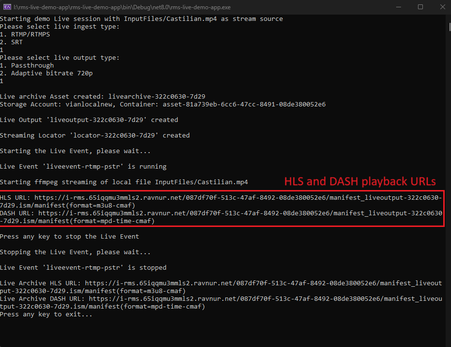

## Configure and run the Live streaming RMS API Demo Application for the Azure Media SDK
The RMS Live Streaming Demo App enables developers to test live streaming workflows using the RMS API. When executed, the application uses FFMPEG to generate an RTMP stream from a local file and streams it to RMS. The stream is then ingested, processed, and output URLs are generated for playback in a demo player.

The application code leverages the Azure SDK and demonstrates how to interact with the RMS API.

The RMS Live Streaming Demo App will enable you to:

✅ Create a live event.

✅ Ingest different streaming protocols:

    SRT (Secure Reliable Transport)

    RTMP (Real-Time Messaging Protocol) and RTMPS

✅Select your desired encoding:

    Passthrough streaming

    Adaptive Bitrate (ABR) streaming

Requirement for using the Demo: An active RMS account.

1. Open a command prompt in your working directory
2. Clone the repo: ```git clone https://github.com/Ravnur-Inc/ams-api-replacement-demo-app.git```
3. Go to app folder ```cd ams-api-replacement-demo-app/rms-live-demo-app```
4. Get your RMS instance credentials using [these instructions](https://github.com/Ravnur-Inc/ams-api-replacement-demo-app/blob/main/docs/how-to-get-credentials.md)
5. To configure the RMS connection, set the following environment variables (if you use the Ravnur-hosted RMS POC instance, contact us to get those credentials):

    ```json
        "SubscriptionId": "<RMS account subscription ID>",
        "ResourceGroupName": "<RMS account resource group name>",
        "MediaServicesAccountName": "<RMS account name>",
        "ApiEndpoint": "<RMS instance API endpoint>",
        "ApiKey": "<RMS instance API key>"
    ```
        
    > - If you are using the default RMS storage, no additional setup is required — it works out of the box.
    > - If you want to use a custom storage account, you need to retrieve an Access Key from the Azure Portal:
    >
    >   - Navigate to Storage Account > Security + Networking > Access keys.
    > 
    >   - Share the key with Ravnur support at support@ravnur.com, and we will configure it for you.
    >  
    >   The Managed Identity connection is not supported. 
    
    For Linux/Mac use the "export" command. If it is more convenient for you, you can set the corresponding settings in the appsettings.json file. If you prefer using your IDE, then the launchSettings.json file will be more convenient for you.

6. Build and run the application:
     ```console
        dotnet build
        dotnet run
    ```

8. The output of the program will look like this:

Check the description for the UI elements [here](https://github.com/Ravnur-Inc/ams-api-replacement-demo-app/blob/live-demo/rms-live-demo-app/readme.md#the-elements-in-the-application-interface).

9. Start interaction from the first prompt. Choose the live ingest  type:
   
    Press `1` to choose RTMP  – standard protocol for live streaming workflows.

    Press `2` to choose SRT – secure protocol with encryption option.

  
10. Choose the live output type:
    
    Press `1` to choose Passthrough – streams the original quality without modification.

    Press `2` to choose Adaptive Bitrate (720p) – dynamically adjusts quality based on network conditions.

    #### Streaming Workflow Overview

    After selecting the options, the application performs the following steps:
    1. Starts a new Live Event for the stream (up to **3 minutes** to start a node if the node pool is in a cold state).
    2. Retrieves the ingest URL and access token (for RTMP or SRT) from the live event configuration.
    3. Runs FFmpeg as a separate process (a new window appears with the detailed event log) and streams the input file to the RMS ingest URL, looping media until stopped manually. 
    4. Generates playback URLs (HLS and DASH) for the live event.
   

    #### Ingest URL details

    - __RTMP ingest protocol__

    ```csharp
            private static void StartFfmpegStreaming(string inputFile, MediaLiveEventResource liveEvent)
            {
                Thread.Sleep(5000);
    
                // Get the Ingest URL and Access Token(Streaming Key) to use in streaming app for RTMP
                string ingestUrl = liveEvent.Data.Input.Endpoints[0].Uri.AbsoluteUri;  
                string accessToken = liveEvent.Data.Input.AccessToken;
    ```
    
    The `ingestUrl` provides the endpoint and token needed to set up manual streaming.
    
    `ingestEndpoint` and `accessToken` come from the `liveEvent.Data.Input` object, which contains the live event's ingest configurations. They are set automatically by RMS when a live event is created and can't be changed.
    - __SRT ingest protocol__
    
    In this case, the app constructs an SRT ingest URL with its parameters:
    ```html
     ingestUrl = $"{ingestEndpoint}?streamid={accessToken}&passphrase={passphrase}&mode=caller&latency={latency}&pbkeylen=16&encrypt=1&maxbw={maxBandwidth}"
    ```
    
    Because the Azure SDK does not support the SRT protocol directly, the app retrieves SRT-specific parameters via the __Tags__ of the `liveEvent` object:
    - `Passphrase`
    - `Latency`
    - `MaxBandwidth`
      
    
    >  The SRT-specific parameters (`Passphrase`, `Latency`, `MaxBandwidth`) are stored in the RMS database and cannot be modified. If you need to update these parameters, please contact Ravnur support at support@ravnur.com.
    

11. Validation
    
    Test the HLS playback links using one of the following tools:
    
    - [The HLS.js player](https://hlsjs.video-dev.org/demo/).
    
    - The [Ravnur Demo Player](https://strmsdemo.z13.web.core.windows.net/). The source code for the player is available in the [RavPlayer repository](https://github.com/Ravnur-Inc/ravplayer).
   
    Test the DASH playback links using [Shaka Demo Player](https://v1-6-5-dot-shaka-player-demo.appspot.com/).

12. Live archive

    When you manually stop the stream, live archive links are generated. The demo application automatically uses the RMS storage account created with your RMS instance. No additional configuration is required unless you prefer to use a custom storage account.
    
    But if you prefer to use your own storage account for DVR, you will need to provide the [storage account key](https://github.com/Ravnur-Inc/ams-api-replacement-demo-app/tree/live-demo/rms-live-demo-app#:~:text=instance%20API%20key%3E%22-,Note,-The%20storage%20must) to Ravnur support at support@ravnur.com.
    

### AMS to RMS code changes explanation

To repoint the AMS SDK to the RMS instance, you need to create a custom implementation of the TokenCredentials class (see [RmsApiKeyCredentials.cs](https://github.com/Ravnur-Inc/ams-api-replacement-demo-app/blob/main/sdk-azure-resource-manager-demo/RmsApiKeyCredentials.cs)).

This is the code which you need to connect the SDK to AMS:

```csharp
private MediaServicesAccountResource CreateAmsClient()
{
    ArmClient armClient = new ArmClient(new DefaultAzureCredential());

    var mediaServicesAccountIdentifier = MediaServicesAccountResource.CreateResourceIdentifier(
        _azureOptions!.SubscriptionId,
        _azureOptions.ResourceGroupName,
        _azureOptions.MediaServicesAccountName);

    return armClient.GetMediaServicesAccountResource(mediaServicesAccountIdentifier);
}
```

This is the code you need to point the SDK to the RMS instance:

```csharp
private MediaServicesAccountResource CreateRmsClient()
{
    ArmClient armClient = new ArmClient(
        new RmsApiKeyCredentials(
            authorityUri: new Uri(_rmsOptions.ApiEndpoint),
            subscriptionId: _rmsOptions.SubscriptionId ?? throw new ConfigurationErrorsException("Rms SubscriptionId is missing"),
            apiKey: _rmsOptions.ApiKey),
        _rmsOptions.SubscriptionId,
        new ArmClientOptions
        {
            Environment = new ArmEnvironment(new Uri(_rmsOptions.ApiEndpoint), "test"),
        });

    var mediaServicesAccountIdentifier = MediaServicesAccountResource.CreateResourceIdentifier(
        _rmsOptions.SubscriptionId,
        _rmsOptions.ResourceGroupName,
        _rmsOptions.MediaServicesAccountName);

    return armClient.GetMediaServicesAccountResource(mediaServicesAccountIdentifier);
}
```
### The elements in the application interface

| #  | Interface Element            | Description                                                                                              |
|----|------------------------------|----------------------------------------------------------------------------------------------------------|
| 1  | Input file                  | Displays the path of the video file to be streamed (e.g., `InputFiles/Castilian.mp4`).                   |
| 2  | Live ingest type               | Prompts the user to select between **RTMP** or **SRT** for the live event.    |
| 3  | Live output type            | Prompts the user to select between **Passthrough** or **Adaptive bitrate (720p)** for the live event.    |
| 4  | Asset creation          | Displays the name of the created live archive asset (e.g., `livearchive-<unique-id>`).                  |
| 5  | Storage account         | Displays the name of the Storage account for a created live archive asset (e.g., `storagelocalnew`).                  |
| 6  | Live output creation     | Logs the creation of the live output (e.g., `liveoutput-<unique-id>`).                                   |
| 7  | Streaming locator creation         | Displays the name of the streaming locator generated (e.g., `locator-<unique-id>`).                     |
| 8  | Live event status           | Confirms when the live event starts and logs the running state (e.g., `Live Event <name> is running`).   |
| 9  | FFmpeg streaming log        | Indicates that FFmpeg has started streaming and provides the input file path.                           |
| 10  | Playback URLs               | Displays HLS and DASH playback URLs for real-time viewing.                                              |
| 11  | Stop live event prompt      | Instructs the user to press any key to stop the live event.                                              |
| 12 | Live event stopping log     | Logs the stopping process and confirms when the live event is stopped.                                  |
| 13 | Live archive playback URLs           | After stopping, displays HLS and DASH URLs for archived (DVR) playback.                                 |
| 14 | Exit prompt           | Instructs the user to press any key to quit the application.                                    |
