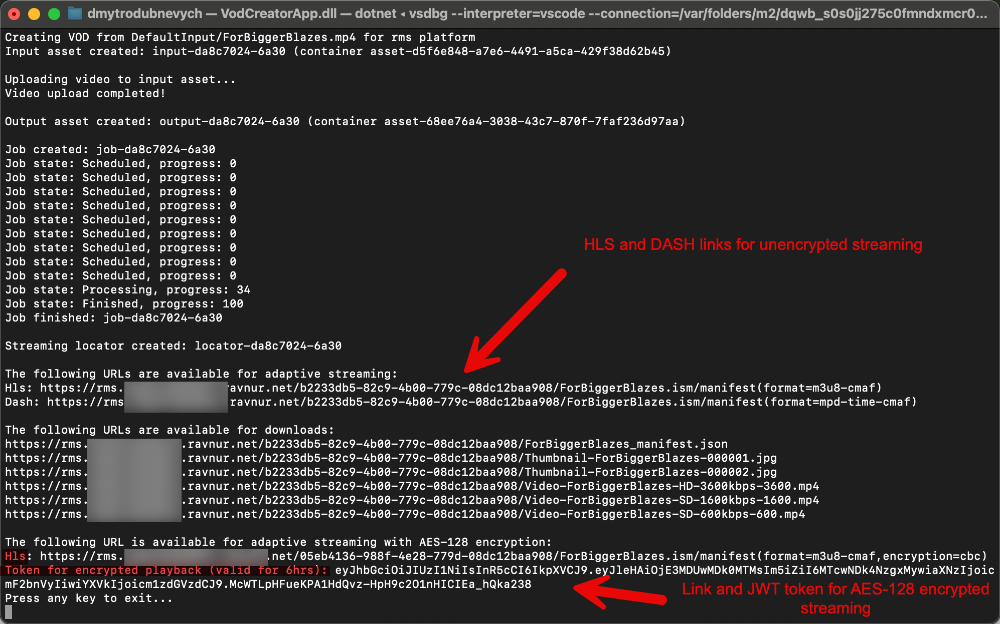

### Configure and run the RMS API Demo Application for the Azure.Resource.Manager.Media SDK

1. Open a command prompt in your working directory
2. Clone the repo: ```git clone https://github.com/Ravnur-Inc/ams-api-replacement-demo-app.git```
3. Go to app folder ```cd ams-api-replacement-demo-app/sdk-azure-resource-manager-demo```
4. Get your RMS instance credentials using [these instructions](../docs/how-to-get-credentials.md)
5. To configure the RMS connection, set the following environment variables (if you use the Ravnur-hosted RMS POC instance, contact us to get those credentials):

    ```console
    set Ravnur__SubscriptionId=<RMS account subscription ID>
    set Ravnur__ResourceGroupName=<RMS account resource group name>
    set Ravnur__MediaServicesAccountName=<RMS account name>
    set Ravnur__ApiEndpoint=<RMS instance API endpoint>
    set Ravnur__ApiKey=<RMS instance API key>
    ```

    For Linux/Mac use the "export" command. If it is more convenient for you, you can set corresponding settings in the appsettings.json file. If you prefer using your IDE, then the launchSettings.json file will be more convinient for you.
6. Build and run the application:

    ```console
    dotnet build
    dotnet run
    ```

    If you start the application without any command line arguments, it will encode the default video that is included in the package using the configured RMS instance. However, you probably will want to upload and encode your own videos, so you can specify the video file to encode as a command line argument:

    ```console
    dotnet run rms <local path or URL of a video/audio file>
    ```
    If you're uploading from your loacal machine, a very large file may trigger a timeout after 100 seconds. This is caused by the testing app, not RMS. Using a URL transfers files faster.

    If for some reason you need test videos, this link has several: https://gist.github.com/jsturgis/3b19447b304616f18657<br>
    The app creates simple custom transform which generates: 3 video qualities, 1 audio quality and several thumbnail images.<br>
    Then it applies to your video and make two streaming locators: 1 - unencrypted HLS/DASH streaming locator with downloads enabled, 2 - AES-128 encrypted HLS streaming locator.

7. The output of the program will look like this:
    
    > [!NOTE]
    > A job can stay in Queued state for a minute. The Ravnur-hosted RMS instance is shared, so potentially it can take even longer if all VMs in the pool are occupied. The encoding pool size is configurable, so if you need to support 20 concurrent encoding jobs, for example, you can set the pool size to meet your needs.
8. Grab a streaming URL and test the playback in a player:
    https://hlsjs.video-dev.org/demo/ - for HLS
    https://reference.dashif.org/dash.js/latest/samples/dash-if-reference-player/index.html - for DASH<br>
    https://strmsdemo.z13.web.core.windows.net/ - Ravnur Media Player (HLS) with option for AES-128 encryption

    > [!NOTE]
    > The RMS streaming URLs will not work with the Azure Media Player. It, too, is being retired, and we can't say we're sad to see it go. You will need to replace the AMP with a new player, and ideally you should test the streaming locator with your player of choice.<br>
9. You can test to ensure that it works with your existing AMS account. To do that login to Azure and set environment variables:

    ```console
    az login

    set Azure__SubscriptionId=<AMS subscription ID>
    set Azure__ResourceGroupName=<AMS resource group>
    set Azure__MediaServicesAccountName=<AMS account name>
    set=Azure__AadTenantId=<AMS AAD Tenant ID>
    set=Azure__ClientId=<AMS AAD Client ID>
    set=Azure__ClientSecret=<AMS AAD Client Secret>
    ```

    then run command:

    ```console
    dotnet run ams <local path or URL of a video/audio file>
    ```

10. Inspect the code to ensure that it shares the same SDK instructions (except for the connection/credentials part). This code is in [VodProvider.cs](VodProvider.cs) file. For example here you can find transform code which you can change to try your own settings.

    ```csharp
    var outputs = new MediaTransformOutput[]
    {
        new MediaTransformOutput(
            new StandardEncoderPreset(
                codecs: new MediaCodecBase[]
                {
                    new AacAudio
                    {
                        Channels = 2,
                        SamplingRate = 48000,
                        Bitrate = 128000,
                        Profile = AacAudioProfile.AacLc,
                    },
                    new H264Video
                    {
                        KeyFrameInterval = TimeSpan.FromSeconds(2),
                        Layers =
                        {
                            new H264Layer(bitrate: 3600000)
                            {
                                Width = "1280",
                                Height = "720",
                                Label = "HD-3600kbps",
                            },
                            new H264Layer(bitrate: 1600000)
                            {
                                Width = "960",
                                Height = "540",
                                Label = "SD-1600kbps",
                            },
                            new H264Layer(bitrate: 600000)
                            {
                                Width = "640",
                                Height = "360",
                                Label = "SD-600kbps",
                            },
                        },
                    },
                    new JpgImage(start: "25%")
                    {
                        Start = "25%",
                        Step = "25%",
                        Range = "80%",
                        Layers =
                        {
                            new JpgLayer
                            {
                                Width = "50%",
                                Height = "50%",
                                Label ="50perc",
                            },
                            new JpgLayer
                            {
                                Width = "30%",
                                Height = "30%",
                                Label ="30perc",
                            },
                            new JpgLayer
                            {
                                Width = "90%",
                                Height = "90%",
                                Label ="90perc",
                            },
                        },
                    },
                },
                formats: new MediaFormatBase[]
                {
                    new Mp4Format(filenamePattern: "Video-{Basename}-{Label}-{Bitrate}{Extension}"),
                    new JpgFormat(filenamePattern: "Thumbnail-{Basename}-{Label}-{Index}{Extension}"),
                })),
    };
    ```

### AMS to RMS code changes explanation

To repoint the AMS SDK to the RMS instance, you need to create a custom implementation of the TokenCredentials class (see [RmsApiKeyCredentials.cs](RmsApiKeyTokenCredentials.cs)).

This is the code which you need to connect the SDK to AMS:

```csharp
private MediaServicesAccountResource CreateAmsClient()
{
    ArmClient armClient = new ArmClient(new DefaultAzureCredential());

    var mediaServicesAccountIdentifier = MediaServicesAccountResource.CreateResourceIdentifier(
        _azureOptions!.SubscriptionId,
        _azureOptions.ResourceGroupName,
        _azureOptions.MediaServicesAccountName);

    return armClient.GetMediaServicesAccountResource(mediaServicesAccountIdentifier);
}
```

This is the code you need to point the SDK to the RMS instance:

```csharp
private MediaServicesAccountResource CreateRmsClient()
{
    ArmClient armClient = new ArmClient(
        new RmsApiKeyCredentials(
            authorityUri: new Uri(_rmsOptions.ApiEndpoint),
            subscriptionId: _rmsOptions.SubscriptionId ?? throw new ConfigurationErrorsException("Rms SubscriptionId is missing"),
            apiKey: _rmsOptions.ApiKey),
        _rmsOptions.SubscriptionId,
        new ArmClientOptions
        {
            Environment = new ArmEnvironment(new Uri(_rmsOptions.ApiEndpoint), "test"),
        });

    var mediaServicesAccountIdentifier = MediaServicesAccountResource.CreateResourceIdentifier(
        _rmsOptions.SubscriptionId,
        _rmsOptions.ResourceGroupName,
        _rmsOptions.MediaServicesAccountName);

    return armClient.GetMediaServicesAccountResource(mediaServicesAccountIdentifier);
}
```
